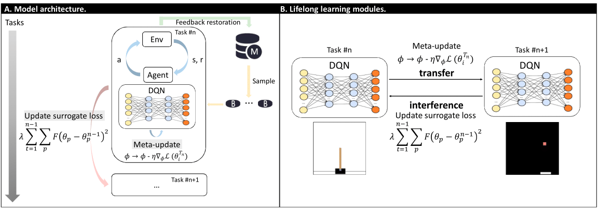

# Reconciling Meta Learning and Regularization in Lifelong Reinforcement Learning with Non-stationary Environments

This is the implementation of the following course project report: 
[Reconciling Meta Learning and Regularization in Lifelong Reinforcement Learning with Non-stationary Environments](https://github.com/ffeng1996/metaContinualRL/blob/master/paper/paper.pdf).



## Requirements
The current version of the code has been tested with following libs:
* `tensorflow 1.15.0`
* `gym 0.16.0`
* `tqdm`
* `visdom`
* `Pillow`
* `ple`

Install the required the packages inside the virtual environment:
```
$ conda create -n yourenvname python=3.7 anaconda
$ source activate yourenvname
$ pip install -r requirements.txt
$ git clone https://github.com/ntasfi/PyGame-Learning-Environment.git
$ cd PyGame-Learning-Environment/
$ pip install -e .
```
Experimental platform (hardwares):
* `Intel CPU`
* `Nvidia RTX 2080 Ti GPU`
* `CUDA Toolkit 10.*`


### How to run the code
#### Download the code
```
git clone https://github.com/ffeng1996/metaContinualRL
```
#### Quickly hands-on
Run following scripts to reproduce experiments:
```
bash baseline.sh
```
## Issue/Want to Contribute ? 
Open a new issue or do a pull request in case you are facing any difficulty with the code base or if you want to contribute.

## Related Works
[Learning to Learn without Forgetting by Maximizing Transfer and Minimizing Interference (MER)](https://arxiv.org/pdf/1810.11910.pdf) [[code for supervision]](https://github.com/mattriemer/mer)

[Deep Online Learning via Meta-learning: Continual Adaptation for Model-based RL](https://arxiv.org/pdf/1812.07671.pdf)

[Reinforcement Learning for Non-Stationary Environments](https://arxiv.org/pdf/1905.03970.pdf)

[Learning to Adapt in Dynamic, Real-world Enviroments Through Meta-Reinforcement Learning](https://arxiv.org/pdf/1803.11347.pdf)

[Continual Reinforcement Learning with Diversity Exploration and Adversarial Self-Correction](https://arxiv.org/pdf/1906.09205.pdf)

[DISCORL: Continual Reinforcement Learning via Policy Distillation](https://arxiv.org/pdf/1907.05855.pdf)


[Continual Reinforcement Learning with Complex Synapses](http://proceedings.mlr.press/v80/kaplanis18a/kaplanis18a.pdf)


## Resources
### Continual learning
[Continual Lifelong Learning with Neural Networks: A Review](https://arxiv.org/abs/1802.07569)

[Continual Learning Data Former](https://github.com/TLESORT/Continual_Learning_Data_Former)
```
 A pytorch compatible data loader to create and use sequence of tasks for Continual Learning 
```

[Continual Learning Literature](https://github.com/optimass/continual_learning_papers)

[Lifelong learning coursework by Hung-yi Lee, short](https://www.youtube.com/watch?v=7qT5P9KJnWo&list=PLJV_el3uVTsOK_ZK5L0Iv_EQoL1JefRL4&index=25)

### Meta learning
[MAML](https://arxiv.org/abs/1703.03400) [[code]](https://github.com/cbfinn/maml)
```
 Fundamental work in meta learning field.  
```

[Meta learning coursework by Hung-yi Lee, short](https://www.youtube.com/watch?v=EkAqYbpCYAc&list=PLJV_el3uVTsOK_ZK5L0Iv_EQoL1JefRL4&index=32)

[Meta learning course by Chelsea Finn, long](https://www.youtube.com/playlist?list=PLoROMvodv4rMC6zfYmnD7UG3LVvwaITY5)
